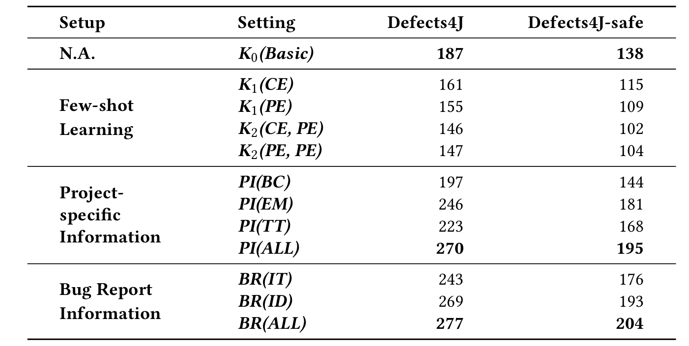
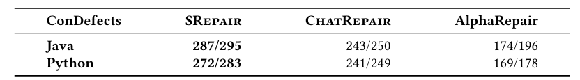
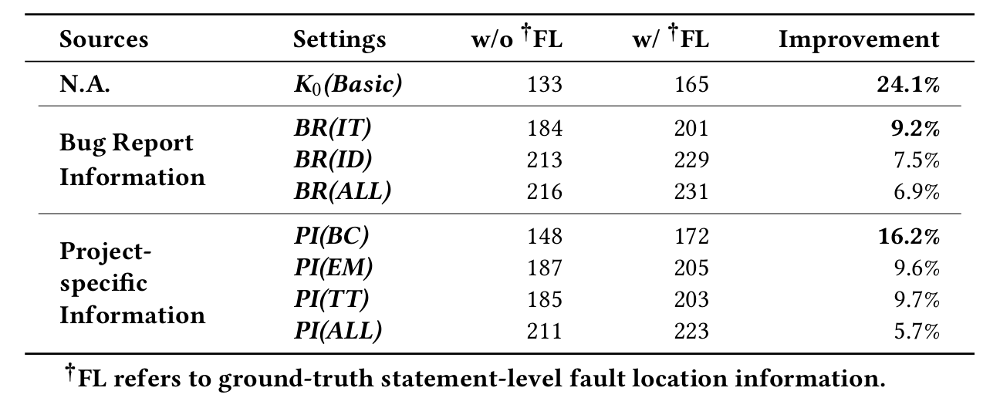

# About *Function-level APR* &. *SRepair*

This artifact repository provides all data, replication procedures, and code of the paper **Practical LLM-Based Function-Level Automated Program Repair: How Far Are We?** for public evaluation. Specifically, all the patches in study section and correct patches generated by SRepair are provided in `./Study/patch`  folder and `./SRepair/correct_patch` folder. Furthermore, we attempt to include some supplementary materials and findings from the research process in the Supplementary Material section which are omitted due to the page limit in our paper.

# Quick Start

### **Environment requirements**

**OS**: A Linux system with **[Docker](https://docs.docker.com/engine/install/)** support. (Optional: [NVIDIA Docker](https://github.com/NVIDIA/nvidia-docker) support)

**GPUs:** NVIDIA GPU(s) with >20G memory

Specifically, you need to select the PyTorch installation according to your GPU and the version of CUDA you are using. For more details, please refer to https://pytorch.org/get-started/locally/.

### Docker install

We provide a Dockerfile for setting up the APR environment directly. First, build the LLM4APR image using the Dockerfile.

```docker build ./ --tag llm4apr```

Then create a container from the image and run:

```docker run -it --name llm4apr_ctn llm4apr```
or 
```docker run -it --gpus all --name llm4apr_ctn llm4apr ```
to enable gpus in docker. (See [NVIDIA Docker](https://github.com/NVIDIA/nvidia-docker))

### Download OpenSrc Models

You can utilize the scripts we provide to pre-download the models to your local environment, facilitating subsequent experiments. Specifically, please download the models individually as needed from the `pull_models.py` script.

# Reproduce Study

## Model configuration

We utilized the following models, with specific parameters and relevant references shown in the table below.
    
| Models | Parameter Size | Link |
| --- | --- | --- |
| GPT-4-0613 | - | https://platform.openai.com/docs/models/gpt-4 |
| GPT-3.5-Turbo-1106 | - | https://platform.openai.com/docs/models/gpt-3-5-turbo |
| Llama-3.1-8B-Instruct | 8B | https://huggingface.co/meta-llama/Llama-3.1-8B-Instruct |
| Magicoder | 7B | https://huggingface.co/ise-uiuc//Magicoder-S-CL-7B |
| Starcoder2-15b-instruct-v0.1 | 15B | https://huggingface.co/bigcode/starcoder2-15b-instruct-v0.1 |

Specifically, to use the GPT-3.5-Turbo or GPT-4-0613 model, you should set your own OpenAI API key by adding os.environ['OPENAI_API_KEY'] = 'your-api-key' in the file ./Study/src/apr_gen_patch.py."

## Study: Patch Generation

To generate patches, execute `./Study/src/apr_gen_patch.py` as follows:
    
```java
cd /path/to/repo/
python3 ./Study/src/apr_gen_patch.py -d ./Study/dataset/defects4j-sf.json -o ./math2_patches.json -m chatgpt -s 2 -bug Math-2
```

It will generate patches with sample size=2 by chatgpt model for bug Math-2. If you wish to explore more diverse APR settings, such as sampling 20 patches for all single function bugs, you can further refer to the parameter settings. 
    
<details><summary>parameter setting</summary>
<div>

Below, we will provide a detailed explanation of the parameters for this method:

- `d`: Specifies the path to the dataset. This argument is required.
- `o`: Specifies the path to the patch result. This argument is required.
- `m`: Specifies the model to be used. This argument is required. Specifically, we have six different models, and to simplify command-line input, we have abbreviated their names.
  
  | Models | Abbreviation |
  | --- | --- |
  | GPT-3.5-Turbo | chatgpt |
  | GPT-4-0613 | gpt4 |
  | Magicoder | magicoder |
  | Llama-3.1-8B-Instruct | llama3 |
  | StarCoder2-15B-Instruct-v0.1 | starcoder2 |

- `s`: Specifies the sample size. This argument is optional, with a default value of 1.
- `bug`: Specifies the bug. This argument is optional.
- `k`: Specifies the k-shot learning setting. This argument is optional, with a default value of 0.
- `ce`: Specifies whether to use crafted examples. This argument is optional and defaults to False.
- `fl`: Specifies whether to use fault localization information. This argument is optional and defaults to False.
- `info`: Specifies repair information using a predefined format. This argument is optional and has a default value of an empty string. Specifically, we have totally seven different settings.
        
        
    | Repair Information  Setting | Abbreviation |
    | --- | --- |
    | Issue Title | it |
    | Issue Description | id |
    | Bug Report (Issue Title + Issue Description) | br |
    | Trigger Test | tt |
    | Error Message | em |
    | Buggy Comment | bc |
    | Project Information(Trigger Test + Error Message + Buggy Comment) | pi |

These parameters are used to configure and control the behavior of the program when generating patches.
</div>
</details>

## Study: Patch Validation

After generating patches (or directly using the patches provided by us), you can further validate them to determine their status, such as plausible, test-failure, or uncompilable.
    
```java
python3 ./Study/src/val_d4j.py -i ./math2_patches.json -o ./math2_patches_val -d ./Study/dataset/defects4j-sf.json
```

<details><summary>parameter setting</summary>
<div>

Based on these parameters:

- `i`: Specifies the patch file path. This argument is required.
- `o`: Specifies the validation result output path. This argument is optional and defaults to `/tmp/llm4apr_validation/result`.
- `d`: Specifies the validation dataset path. This argument is optional.
- `log`: Specifies whether to enable logging mode. This argument is optional and activates logging to `validation.log` when enabled.

These parameters are used for configuring the validation process for patches, including input/output paths and logging options.

</div>
</details>


# Reproduce SRepair

## SRepair: Repair Suggestion

To generate suggestions for single function bugs, execute `./SRepair/src/sf_gen_solution.py` as follows:

```java
python3 ./SRepair/src/sf_gen_solution.py -d ./SRepair/dataset/defects4j-sf.json -o ./math2_solution.json -s 2 -bug Math-2
```

It will query chatgpt model twice, generating multiple distinct bug-fixing suggestions for bug Math-2. Its raw output will be stored in the file `./math2_solution.json`, and the extracted suggestions will be stored in `./math2_solution_extracted.json`. Below is the detailed parameter setting. 

<details><summary>parameter setting</summary>
<div>

Below, we will provide a detailed explanation of the parameters for this method:

- `d`: Specifies the path to the dataset. This argument is required.
- `o`: Specifies the path to the raw output. This argument is required.
- `eo`: Specified the path to extracted suggestions. This argument is optional.
- `s`: Specifies the sample size. This argument is optional, with a default value of 1.
- `bug`: Specifies the bug to generate suggestion for. This argument is optional.

These parameters are used to configure and control the behavior of the program when generating suggestions.
</div>
</details>

To generate suggestions for multi-function bugs, execute `./SRepair/src/mf_gen_solution.py` as follows:

```java
python3 ./SRepair/src/mf_gen_solution.py -d ./SRepair/dataset/defects4j-mf.json -o ./chart19_solution.json -s 2 -bug Chart-19
```

Its usage is similar to `sf_gen_solution.py`, except that it will only generate one distinct suggestion per query, so the above command will only generate two distinct suggestions for bug Chart-19.

## SRepair: Patch Generation

To generate patches for single function bugs, execute `./SRepair/src/sf_gen_patch.py` as follows:

```java
python3 ./SRepair/src/sf_gen_patch.py -d ./SRepair/dataset/defects4j-sf.json -s ./math2_solution_extracted.json -o ./math2_patches.json -bug Math-2
```

It will generate patches for bug Math-2, with its sample size decided by the number of provided suggestions (5 patches for each suggestion). Below is the detailed parameter setting. 

<details><summary>parameter setting</summary>
<div>


Below, we will provide a detailed explanation of the parameters for this method:

- `d`: Specifies the path to the dataset. This argument is required.
- `s`: Specifies the path to the suggestions. This argument is required.
- `o`: Specifies the path to the generated patch. This argument is required.

- `bug`: Specifies the bug to generate suggestion for. This argument is optional.
  </div>
  </details>

To generate patches for multi-function bugs, execute `./SRepair/src/mf_gen_patch.py` as follows:

```java
python3 ./SRepair/src/mf_gen_patch.py -d ./SRepair/dataset/defects4j-mf.json -s ./chart19_solution_extracted.json -o ./chart19_patches.json -bug Chart-19
```

Its usage is similar to `sf_gen_patch.py`.

## SRepair: Patch Validation

For single function bugs, the validation process is identical to that in study part, since the format of generated patches is not changed.

```java
python3 ./SRepair/src/sf_val_d4j.py -i ./math2_patches.json -o ./math2_patches_val -d ./SRepair/dataset/defects4j-sf.json
```

For multi-function bugs, they can be validated by executing `./SRepair/src/mf_val_d4j.py` as follows:

```java
python3 ./SRepair/src/mf_val_d4j.py -i ./chart19_patches.json -o ./chart19_patches_val -d ./SRepair/dataset/defects4j-mf.json
```

And its parameter setting is still the same as the setting of single function validation.

# Supplementary materials

## RQ1: Crafted Examples and K-Shot

While prior work only utilizes one crafted example (binarySearch), we also aim to incorporate various crafted examples created by us to investigate the performance impact. Specifically, we conduct the experiment only 277 single-function bugs in Defects4J 1.2 and sample 200 times using `Starcoder2-15b-instruct-v0.1` model. The evaluation result is shown in Table below.

| Setting | Crafted Example | # Plausible fixes|
| --- | --- | --- |
| K1(CE) | BinarySearch | 84 |
| K1(CE) | Fibonacci | 89 |
| K1(CE) | Bubble Sort | 79 |
| K2(CE, CE) | BinarySearch & Fibonacci | 82 |
| K2(CE, CE) | BinarySearch & Bubble Sort | 75 |


## 3.4.2 RQ2——Bug Report with explicit fix instructions

Upon manually analyzing bug reports, we identify 38 bugs that include explicit patch or fix instructions, such as “to fix, check if the parser’s headerMap is null before trying to create the returned map” in the Csv-4’s bug report. We then divide our Defects4J dataset into two sets—one consisting of the 38 bugs with fix instructions and another consisting of the remaining 484 bugs. The corresponding bug lists are located at `resource/bug-report` directory.


## 4.2.3 Compared Techniques——Fault Localization Results

We adopt the function-level fault localization technique DepGraph to assess the practical applicability and generalizability of SRepair’s end-to-end repair performance against the studied baselines. Specifically, following prior works, we utilize correct fix results gathered from previous papers for comparison, and we re-implement or re-run the baselines’ original setups to obtain missing end-to-end fixing results. The relevant data and code are located at `resource/fault-localization`.

In particular, SRepair generates 10 patches for the most suspicious function produced by DepGraph for each bug, hereby evaluating SRepair’s performance with fault localization. Following prior work [6], for a series of prior works (i.e., FitRepair, ChatRepair) that did not report their fix results with fault localization, we obtained the replication packages and code from their public repositories and re-ran them with fault localization under the same setting as specified in the original papers. For D4C and GiantRepair, we adhere to their original settings on Defects4J V1 and re-ran corresponding fault localization techniques on Defects4J V2, with retrieving their fix results under perfect fault localization to obtain the results on Defects4J V2.


## 4.2.5 Ablation and Configuration Study

We further attempt to investigate different model configurations of SRepair and conduct ablation study of the SRepair Dual-LLM CoT framework. In this experiment, The results are presented in the table:

  | Seting | # Plausible Fixes |
  |-----------|------------|
  | StarCoder2-PI(ALL)     | 203 |
  | SRpair (GPT4 - Starcoder2) | 272 |
  | SRpair (GPT3.5 - Starcoder2) | 249 |
  | SRpair (Llama3.1 - Starcoder2) | 231 |
  | SRpair (Llama3.1 - Magicoder) | 228 |
    
Interestingly, we can find that various models we studied benefit from the Dual-LLM CoT framework, with improvements in plausible fixes ranging from 12.3% to 34% compared with StarCoder2-PI(ALL), demonstrating the effectiveness and generalizability of SRepair framework.

## 5.2 Disccusion: Data leakage

Data leakage is a critical concern in LLM-based APR. To evaluate its impact on our work, we conduct several experiments.

We evaluate SRepair fully constructed by StarCoder2 (refered as SRepair*) on Defects4J and GrowingBugs dataset. Notebly, StarCoder2 provides a webpage [1] to detect data leakage. We leverage this page to evaluate data leakage situation of Defects4J (522 single-function bugs)and GrowingBugs (988 single-function bugs).
Specifically, we use the Python `selenium` library to interact with the data leakage detection page [1], querying whether the patch code snippet is included in StarCoder2's training data to determine if each bug is affected by data leakage. The script and relevant dataset are located in the `resource/data-leakage` directory.

We find 400 Defects4J single function bugs and 748 GrowingBugs single function bugs are not included in the training data, as denoted as `Defects4J-clean` and `GrowingBugs-clean`, thus forming clean, uncontaminated dataset. 


The plausible fixes of `SRepair*` on `Defects4J` and `GrowingBugs` and their clean subset, are presented in the table below:

 | Dataset | Defects4J(522) | Defects4J-clean(400) | GrowingBugs(988) | GrowingBugs-clean(748) |
 |-----------|-----------|------------|-------------|--------------|
 | SRepair* | 221       | 158        | 442         | 319         |

The results show a similar plausible ratio for SRepair* on both Defects4J (42.3%, 221 out of 522) and Defects4J-clean (39.5%, 158 out of 400), as well as on GrowingBugs (44.7%, 442 out of 988) and GrowingBugs-clean (42.6%, 319 out of 748), demonstrating generalizability and limited impact of data leakage on SRepair evaluation results.

--------

Then, We evaluate the number of plausible fixes generated by StarCoder2 under various experimental settings for both Defects4J and Defects4J-clean datasets, as presented in the table below.



The results demonstrate consistent
trends across both datasets, i.e., the number of plausible fixes in
Defects4J/Defects4J-clean dataset increase to 270/195 in PI(ALL),
and 277/204 in BR(ALL), and decrease to 146/102 in K2(CE, PE) from
187/138 in K0(Basic), validating our findings in the study section.


-------------

Moreover, we adopt two new datasets designed to counter
data leakage concerns to demonstrate the effectiveness and generalizability of SRepair.
First, we perform a comprehensive evaluation on a subset of the DebugBench [2] dataset, following prior work [3], which includes
590 (200/194/196 in C++/Java/Python) single-function bugs. As shown in the table below, SRepair outperforms prior work [3] by fixing 556 bugs.

  | DebugBench-C++ | DebugBench-Java | DebugBench-Python | Total |
  |-----------|------------|-------------|-------------|
  | 191      | 183     |    182    | 556 |


-----------

Next, we evaluate SRepair on the newly released dataset ConDefects, Following prior work [4], we remove any duplicated buggy programs
or tasks and obtain 321 and 330 Java and Python bugs respectively.
As shown in the Table below, The evaluation result indicates that SRepair
consistently demonstrates superior repair performance and gener-
alizability by outperforming ChatRepair and AlphaRepair with at
least 18.1% (287 vs. 243) and 12.8% (272 vs. 241) more correct fixes on the Java and Python versions respectively. 




-------

Furthermore, we also investigate the impact of data leakage on the generated correct patches of SRepair on Defects4J. The results show that, among the 227 correct bug fixes of SRepair, 15 of them are included in StarCoder2's training data, accounting for only 6.6% of the total. Notably, even after removing these 15 potential data leakage bugs, SRepair still achieves 212 correct fixes, outperforming existing state-of-the-art baselines by at least 17.8% (212 vs. 180). The list of the 15 bugs with potential data leakage can be found in `resource/data-leakage/SRepair_leakage_bugs.json`.


These results further validate our findings and approach, effectively mitigating the risk of data leakage affecting.


## 5.3 Disccusion: Assessing Statement-Level Fault Localization Needs

We evaluate the performance impact and necessity of the statement-level fault location information in the function-level APR. We utilize the ground-truth statement-level fault location information following previous work [5] by labeling the corresponding buggy line with /* bug is here */. Specifically, the ground-truth fault locations are provided by the official Defects4J GitHub Repository.

To investigate the impact of the statement-level fault location information on the function-level APR, we calculate the average number of correct fixes generated by various models across different auxiliary repair-relevant information setups. The results are presented in the table below:


We can observe that while applying the statement-level fault location information enhances the repair performance, the extent of this improvement can be potentially compromised with the increase of the auxiliary repair-relevant information (ie., from 24.1% in K0(Basic) shrinks to 6.9% in BR(ALL) and 5.7% in PI(ALL)).


# Reference
[1] 2025-03. Data Leakage Detection https://stack-v2.dataportraits.org/

[2] Tian, Runchu, et al. "Debugbench: Evaluating debugging capability of large language models." arXiv preprint arXiv:2401.04621 (2024).

[3] Xu J, Fu Y, Tan S H, et al. Aligning the Objective of LLM-based Program Repair[J]. arXiv preprint arXiv:2404.08877, 2024.

[4] Xia C S, Zhang L. Automated program repair via conversation: Fixing 162 out of 337 bugs for $0.42 each using ChatGPT[C]//Proceedings of the 33rd ACM SIGSOFT International Symposium on Software Testing and Analysis. 2024: 819-831.

[5] Xia C S, Wei Y, Zhang L. Automated program repair in the era of large pre-trained language models[C]//2023 IEEE/ACM 45th International Conference on Software Engineering (ICSE). IEEE, 2023: 1482-1494.

[6] Lin B, Wang S, Wen M, et al. One Size Does Not Fit All: Multi-granularity Patch Generation for Better Automated Program Repair (ISSTA 2024). Association for Computing Machinery, New York, NY, USA, 1554–1566[EB/OL].(2024)